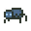

# Run games

/src/main/java/APP.java
line 175 is main function.
You can simply press run button (you must have java extension to run the game)

### static entities
<table>
    <tr>
        <th>Entitiy</th>
        <th>Image</th>
        <th>Descripton</th>
    </tr>
    <tr>
        <th>Wall</th>
        <th></th>
        <th>Blocks the movement of the Player, enemies and boulders</th>
    </tr>
        <tr>
        <th>Exit</th>
        <th></th>
        <th>If the Player goes through it, the puzzle may be complete.</th>
    </tr>
        <tr>
        <th>Boulder</th>
        <th></th>
        <th>Acts like a wall in most cases. The only difference is that it can be pushed by the Player into cardinally adjacent squares. The Player is only strong enough to push one boulder at a time. When the player pushes a boulder, they move into the spot the boulder was previously in. Boulders can be pushed onto collectable entities.</th>
    </tr>
        <tr>
        <th>Floor Switch</th>
        <th></th>
        <th>Switches behave like empty squares, so other entities can appear on top of them. When a boulder is pushed onto a floor switch, it is triggered. Pushing a boulder off the floor switch untriggers.</th>
    </tr>
        <tr>
        <th>Door</th>
        <th></th>
        <th>Exists in conjunction with a single key that can open it. If the Player holds the key, they can open the door by moving through it. Once open, it remains open.</th>
    </tr>
        <tr>
        <th>Portal</th>
        <th></th>
        <th> Teleports entities to a corresponding portal. The player must end up in a square cardinally adjacent to the corresponding portal. The square they teleport onto must also be within movement constraints - e.g. the player cannot teleport and end up on a wall. If all squares cardinally adjacent to the corresponding portal are walls, then the player should remain where they are.</th>
    </tr>
        <tr>
        <th>Zombie Toast Spawner</th>
        <th></th>
        <th>Spawns zombie toasts in an open square cardinally adjacent to the spawner. The Player can destroy a zombie spawner if they have a weapon and are cardinally adjacent to the spawner. If all the cardinally adjacent cells to the spawner are walls, then the spawner will not spawn any zombies.</th>
    </tr>
</table>

### Moving Entities
<table>
    <tr>
        <th>Entitiy</th>
        <th>Image</th>
        <th>Descripton</th>
    </tr>
    <tr>
        <th>Spider</th>
        <th></th>
        <th>Spiders spawn at random locations in the dungeon from the beginning of the game. When the spider spawns, they immediately move the 1 square upwards (towards the top of the screen) and then begin 'circling' their spawn spot (see a visual example below).  
         
        Spiders are able to traverse through walls, doors, switches, portals, exits (which have no effect), but not boulders, in which case it will reverse direction (see a visual example below).  
         
        Spiders spawn in a square that is less than or equal to a radius of 20 (via Manhattan distance) around the player’s current position. If there is no available space, a spider is not spawned. Spiders cannot spawn on boulders, or in the same square as the player/enemies. If a spider is stuck between two boulders in its movement path, it should remain still.
        </th>
    </tr>
        <tr>
        <th>Zombie Toast</th>
        <th></th>
        <th>Zombies spawn at zombie spawners and move in random directions. Zombies are limited by the same movement constraints as the Player, except portals have no effect on them.</th>
    </tr>
        <tr>
        <th>Mercenary</th>
        <th></th>
        <th>Mercenaries do not spawn; they are only present if created as part of the dungeon. They constantly move towards the Player, stopping only if they cannot move any closer (they are able to move around walls). Mercenaries are limited by the same movement constraints as the Player. All mercenaries are considered hostile, unless the Player can bribe them with a certain amount of gold; in which case they become allies. Mercenaries must be within a certain radius of the player in order to be bribed, which is formed by the diagonally and cardinally adjacent cells in a "square" fashion, akin to the blast radius for bombs. As an ally,  the mercenary moves randomly.</th>
    </tr>
        <tr>
        <th>Assassin</th>
        <th></th>
        <th>Assassins are exceptionally powerful mercenaries which deal significantly more damage. When bribing an Assassin, there is a certain chance that the bribe will fail; the gold will be wasted and the Assassin will remain hostile. Battles still do not occur with an Assassin when the player is invisible.</th>
    </tr>
        <tr>
        <th>Swamp Tile</th>
        <th></th>
        <th>As part of this, you will need to extend your solution to accommodate the idea of a swamp tile. These are tiles that have an x and y position and remain fixed throughout the entire game. They slow the movement of all entities through them, except for the player and allies adjacent to the player. Each swamp file has a movement factor which is a multiplying factor of the number of ticks it takes to traverse the tile. 
        For example, let us say the movement factor for a swamp tile is 2:  
        1. Tick 1: MOve onto the swamp tile
        2. Tick 2: Stuck on the swamp tile
        3. Still stuck on the swamp tile
        4. Move off the swamp tile</th>
    </tr>
</table>

### Collectable Entities
<table>
    <tr>
        <th>Entitiy</th>
        <th>Image</th>
        <th>Descripton</th>
    </tr>
    <tr>
        <th>Treasure</th>
        <th></th>
        <th>Can be picked up by the Player.</th>
    </tr>
        <tr>
        <th>Key</th>
        <th></th>
        <th>Can be picked up by the player when they move into the square containing it. The Player can carry only one key at a time, and only one door has a lock that fits the key. Keys disappear once used in any context i.e. opening a door, building an item. If a key is used before opening its door, its corresponding door may be locked forever.</th>
    </tr>
        <tr>
        <th>Invincibility Potion</th>
        <th></th>
        <th>When a Player picks up an Invincibility potion, they may consume it at any time. Any battles that occur when the Player has the effects of the potion end immediately after the first round, with the Player immediately winning and taking no damage. Movement of spiders and bribed mercenaries remains unaffected. The effects of the potion only last for a limited time.</th>
    </tr>
        <tr>
        <th>Invisibility Potion</th>
        <th></th>
        <th>When a player picks up an invisibility potion, they may consume it at any time and they immediately become invisible and can move past all other entities undetected. Battles do not occur when a player is under the influence of an invisibility potion.</th>
    </tr>
        <tr>
        <th>Wood</th>
        <th></th>
        <th>Can be picked up by the Player.</th>
    </tr>
        <tr>
        <th>Wood</th>
        <th></th>
        <th>Can be picked up by the Player.</th>
    </tr>
        <tr>
        <th>Bomb</th>
        <th></th>
        <th>Can be collected by the player. When used it is removed from the inventory it is placed on the map at the player's location. When a bomb is cardinally adjacent to an active switch, it destroys all entities in diagonally and cardinally adjacent cells, except for the player, forming a "square" blast radius. The bomb should detonate when it is placed next to an already active switch, or placed next to an inactive switch that then becomes active. The bomb explodes on the same tick it becomes cardinally adjacent to an active switch. A bomb cannot be picked up once it has been used.</th>
    </tr>
        <tr>
        <th>Sword</th>
        <th></th>
        <th>A standard melee weapon. Swords can be collected by the Player and used in battles, increasing the amount of damage they deal by an additive factor. Each sword has a specific durability that dictates the number of battles it can be used before it deteriorates and is no longer usable.</th>
    </tr>
        <tr>
        <th>Sun Stone</th>
        <th></th>
        <th>A special form of treasure, hard and treasuable. It can be picked up by the player. Can be used to open doors, and can be used interchangeably with treasure or keys when building entities. But it cannot be used to bribe mercenaries or assassins. Since it is classed as treasure it counts towards the treasure goal. When used for opening doors, or when replacing another material such as a key or treasure in building entities, it is retained after use.</th>
</table>

### Buildable Entities
<table>
    <tr>
        <th>Entitiy</th>
        <th>Image</th>
        <th>Descripton</th>
    </tr>
    <tr>
        <th>Bow</th>
        <th></th>
        <th>Can be crafted with 1 wood + 3 arrows. The bow has a durability which deteriorates after a certain number of battles. Bows give the Player double damage in each round, to simulate being able to attack an enemy at range (it can't actually attack an enemy at range).</th>
    </tr>
        <tr>
        <th>Shield</th>
        <th></th>
        <th>Can be crafted with 2 wood + (1 treasure OR 1 key). Shields decrease the effect of enemy attacks. Each shield has a specific durability that dictates the number of battles it can be used before it deteriorates.</th>
    </tr>
        <tr>
        <th>Sceptre</th>
        <th></th>
        <th>Can be crafted with (1 wood OR 2 arrows) + (1 key OR 1 treasure) + (1 sun stone). A character with a sceptre does not need to bribe mercenaries or assassins to become allies, as they can use the sceptre to control their minds without any distance constraint. But the effects only last for a certain number of ticks.</th>
    </tr>
        <tr>
        <th>Midnight Armour</th>
        <th></th>
        <th>Can be crafted with (1 sword + 1 sun stone) if there are no zombies currently in the dungeon. Midnight armour provides extra attack damage as well as protection, and it lasts forever.</th>
    </tr>
</table>

### Goals
each dungeon also has a goal that defines what must be achieved by the player for the dungeon to be considered complete. 

### Basic goals are:
1. Getting to an exit
2. having aboulder on all switches
3. Collecting a certain number of treasure items(or more)

### Complex goals are:
1. Collecting a certain number of treasure AND getting to an exit
2. Collecting a certain number of treasure OR having a boulder on all floor switches
3. Getting to an exit AND (destroying all enemies OR collecting all treasure)

# Winning & Losing
The game is won when all the goals are achieved. The game is lost when the player dies and is removed from the map.
